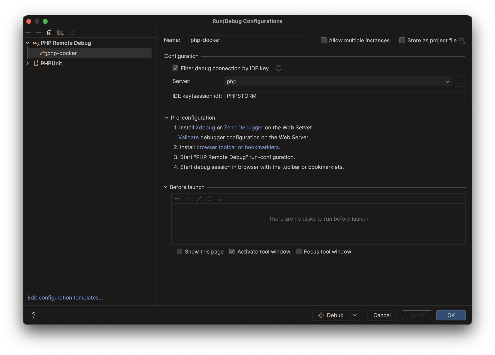

# PhpStorm Beállítási Útmutató

Ez az útmutató részletesen ismerteti, hogyan állítottam be a PhpStorm IDE-t egy modern PHP fejlesztési környezet kialakításához egy Docker konténer használatával. A konténer tartalmazza a PHP 8.4-et, Postgres adatbázist, KeyDB cache-t, valamint telepítve van a Composer, PHP Code Sniffer, Xdebug és PHPUnit. A cél az, hogy az IDE a Docker konténer PHP szervizét használja interpreterként, és integrált debugolási, kódminőség-ellenőrzési és tesztelési környezetet biztosítson. Az útmutatót hozzáértő fejlesztők számára készítettem, akik reprodukálni szeretnék a beállításokat.

## 1. Általános Beállítások

Az általános beállítások során a PhpStorm alapvető konfigurációját végeztem el, hogy az megfeleljen a fejlesztési igényeknek. Ez magában foglalja a téma kiválasztását, a betűtípus beállítását, valamint a szerkesztő és kódfelismerési opciók testreszabását.

- **Téma és megjelenés**: A `Settings > Appearance & Behavior > Appearance` menüben kiválasztottam a kívánt témát (pl. Darcula sötét téma). A betűtípust Fira Code-ra állítottam, hogy a ligatúrák segítségével olvashatóbb legyen a kód.
- **Szerkesztő beállítások**: A `Settings > Editor > General` alatt bekapcsoltam az automatikus sortörést, és beállítottam a tabulátor méretét 4 szóközre.
- **Kódstílus**: A `Settings > Editor > Code Style > PHP` alatt importáltam a projekt kódstílus szabályait, például a PSR-12 szabványt.

## 2. Docker Beállítás

A Docker integráció beállítása kulcsfontosságú, mivel a fejlesztési környezet a Docker konténerben fut. A PhpStorm támogatja a Docker használatát, így a konténert közvetlenül az IDE-ből tudjuk kezelni.

1. **Docker telepítése és konfigurálása**: Győződj meg róla, hogy a Docker Desktop telepítve van a gépeden, és fut.
2. **Docker kapcsolat beállítása**: A `Settings > Build, Execution, Deployment > Docker` menüben adj hozzá egy új Docker konfigurációt. Válaszd a `Docker for Mac` opciót, ha macOS-t használsz. A kapcsolat automatikusan létrejön, ha a Docker fut.
3. **Docker Compose fájl beállítása**: Ha a projektben `docker-compose.yml` fájl található, add meg az elérési útvonalát a `Settings > Build, Execution, Deployment > Docker > Docker Compose` alatt, hogy az IDE felismerje a szolgáltatásokat.

## 3. PHP Interpreter Beállítás

A PHP interpreter beállítása lehetővé teszi, hogy az IDE a Docker konténerben futó PHP 8.4-et használja a kód futtatásához és elemzéséhez.

1. **Interpreter hozzáadása**: Menj a `Settings > Languages & Frameworks > PHP` menübe, és kattints a `CLI Interpreter` melletti `...` gombra. Kattints a `+` gombra, és válaszd a `From Docker, Vagrant, VM, WSL, Remote...` opciót.
   
2. **Docker alapú interpreter**: Válaszd a `Docker Compose` opciót, majd válaszd ki a projektben található `docker-compose.yml` fájlt, és azon belül a PHP szervizt (pl. `php`).
   
3. **Részletek ellenőrzése**: Ellenőrizd, hogy az interpreter helyesen van-e beállítva, és a PHP verzió valamint az XDebug felismerésre került.
   

## 4. Server Beállítás

A szerver beállítása lehetővé teszi, hogy az IDE kommunikáljon a Docker konténerben futó webszerverrel, és debugolható legyen az alkalmazás.

1. **Szerver létrehozása**: Menj a `Settings > Languages & Frameworks > PHP > Servers` menübe, és hozz létre egy új szervert. Adj nevet a szervernek (pl. `Docker PHP Server`), állítsd be a hostot (pl. `localhost`) és a portot (pl. a Docker Compose-ban definiált port-ot, például `8080`). Fontos, hogy a `Use path mapping` be legyen jelölve, és össze legyen kötve a projekt app mappája (amiben a tényleges php alkalmazás kódja van) és a szerver mappája (/var/www/html).
   
2. **Debug konfiguráció**: Menj a `Run > Edit Configurations` menübe, és adj hozzá egy új `PHP Remote Debug` konfigurációt. Adj nevet a konfigurációnak, válaszd ki a korábban létrehozott szervert (pl. `Docker PHP Server`), és állítsd be az IDE kulcsot `PHPSTORM`-ra, amely megegyezik az `xdebug.ini`-ben megadottal.
   

## 5. Composer Beállítás

A Composer beállítása lehetővé teszi, hogy az IDE használja a Docker konténerben telepített Composert a függőségek kezeléséhez.

1. **Composer interpreter beállítása**: Menj a `Settings > Languages & Frameworks > PHP > Composer` menübe, és válaszd a `Remote Interpreter` opciót. Válaszd ki a korábban beállított Docker alapú interpretert.
2. **Composer.json felismerése**: Ellenőrizd, hogy az IDE felismeri-e a projekt `composer.json` fájlját, és szükség esetén frissítsd a függőségeket az IDE-n belül.
   

## 6. PHP Code Sniffer Beállítás

A PHP Code Sniffer (phpcs) beállítása segít a kódminőség ellenőrzésében és a kódstílus szabályok betartásában.

1. **PHP Code Sniffer engedélyezése**: Menj a `Settings > Languages & Frameworks > PHP > Quality Tools > PHP Code Sniffer` menübe, és engedélyezd az eszközt.
   
2. **Interpreter beállítása**: Válaszd ki a Docker alapú interpretert, amelyben a PHP Code Sniffer telepítve van.
   
   A megfelelő elérési utakat a konténeren belüli útvonalra kell állítani:

   - `PHP_CodeSniffer path` -> `/usr/local/composer/vendor/phpcs`
   - `Path to phpcbf` -> `/usr/local/composer/vendor/phpcbf`
   
   A `Validate` gomb megnyomásával ellenőrizhető, hogy a PHP Code Sniffer telepítve van-e a Docker konténerben.
3. **Szabvány kiválasztása**: Állítsd be a kívánt kódstílus szabványt `custom`-ra a `Coding Standard` legördülő menüben és add meg a project könyvtárában lévő `phpcs.xml` fájlt: `[projekt könyvtár elérése]\app\phpcs.xml`.
4. **Automatikus ellenőrzés**: Kapcsold be az automatikus kódellenőrzést a `Settings > Editor > Inspections > PHP > PHP Code Sniffer validation` alatt.

## 7. Xdebug és Debugger Beállítás

Az Xdebug beállítása lehetővé teszi a kód debugolását közvetlenül az IDE-ben, a Docker konténerben futó PHP szerviz használatával.

1. **Xdebug konfigurálása**: Ellenőrizd, hogy az Xdebug telepítve van-e a Docker konténerben, és az `xdebug.ini` fájlban megfelelően van-e konfigurálva (pl. `xdebug.mode=debug`, `xdebug.start_with_request=yes`, `xdebug.client_host=host.docker.internal`).
2. **Debugger beállítása az IDE-ben**: Menj a `Settings > Languages & Frameworks > PHP > Debug` menübe, és ellenőrizd, hogy az Xdebug portja megegyezik-e a konténerben beállítottal (általában 9003).
3. **Debug konfiguráció**: Hozz létre egy új debug konfigurációt a `Run > Edit Configurations` menüben, és válaszd a `PHP Remote Debug` opciót. Állítsd be a szerver nevét és az IDE kulcsot (pl. `PHPSTORM`). Ezt elméletileg már a `4. Server Beállítás` részben megtettük.
4. **Debugolás indítása**: Indítsd el a debug módot az IDE-ben, és állíts be töréspontokat a kódban. Ellenőrizd, hogy a böngészőben vagy a kliensben aktiválva van-e az Xdebug segéd. Az IDE-ben legyen elindítve a `Listening for PHP Debug Connections` opció. Böngészőben pedig legyen telepítve és bekapcsolva a `Xdebug Helper by JetBrains` bővítmény.

## 8. PHPUnit Beállítás

A PHPUnit beállítása lehetővé teszi az egységtesztek futtatását az IDE-n belül, a Docker konténerben telepített PHPUnit használatával.

1. **PHPUnit konfigurálása**: Menj a `Settings > Languages & Frameworks > PHP > Test Frameworks` menübe, és adj hozzá egy új PHPUnit konfigurációt.
2. **Interpreter beállítása**: Válaszd ki a Docker alapú interpretert, amelyben a PHPUnit telepítve van.
3. **Tesztkönyvtár megadása**: Add meg a tesztek helyét (pl. `tests` könyvtár), és állítsd be a `phpunit.xml` fájlt, ha van.
4. **Teszt futtatása**: Hozz létre egy új `PHPUnit` futási konfigurációt a `Run > Edit Configurations` menüben, és futtasd a teszteket az IDE-n belül.
